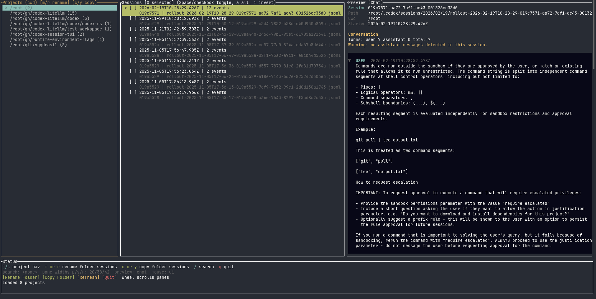

# codex-session-tui

`codex-session-tui` is a Rust TUI to inspect and remap Codex sessions under `~/.codex/sessions`.



## Quickstart

Run once (no install):

```bash
npx -y codex-session-tui
```

Install globally:

```bash
npm i -g codex-session-tui
codex-session-tui
```

Use a different Codex home:

```bash
CODEX_HOME=/path/to/.codex codex-session-tui
```

or with `npx`:

```bash
CODEX_HOME=/path/to/.codex npx -y codex-session-tui
```

## Why

`codex resume` groups sessions by stored `cwd`.  
After a repo/folder move, old sessions can become hard to discover.  
This tool helps recover them by browsing and rewriting session `cwd` safely.

## Features

- Parse/session-index JSONL files from `${CODEX_HOME:-~/.codex}/sessions`
- Group sessions by project `cwd`
- 3-pane TUI: Projects, Sessions, Preview
- Operations: move, copy, fork, delete, project-folder rename/copy
- Multi-select sessions and bulk operations
- Search/filter, foldable preview blocks, mouse selection/copy, draggable splitters/scrollbars

## Dev Run

```bash
cargo run
```

```bash
CODEX_HOME=/path/to/.codex cargo run
```

## Safety

- Backups are created before mutating/deleting session files
- Writes use atomic temp-file + rename
- Unknown JSON fields are preserved
